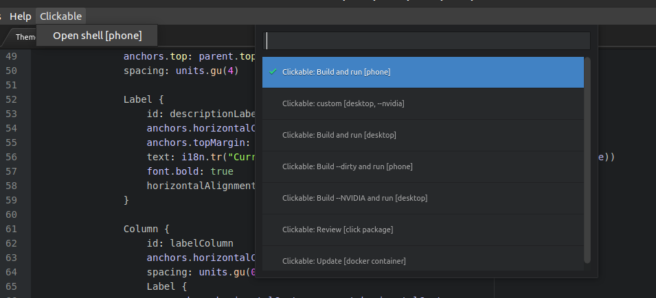

# atom-clickable-plugin

This *atom-clickable-plugin* does provide some common clickable tools needed to build and run click packages for Ubuntu Touch from within Atom editor.

## Credits
This is a fork of the (now unmaintained) original [atom-build-clickable](https://github.com/sverzegnassi/atom-build-clickable) plugin for Atom by `@sverzegnassi`. Many thanks to you for this great work!

## Prerequisites

This package requires [clickable](https://github.com/bhdouglass/clickable) to be installed and available on your system. For detailed instructions on installing and usage please visit [clickable docs](https://clickable-ut.dev/)

## License

This project is licensed under the terms of the MIT license (same as the original plugin). See `LICENSE` for details.

## Screenshot

